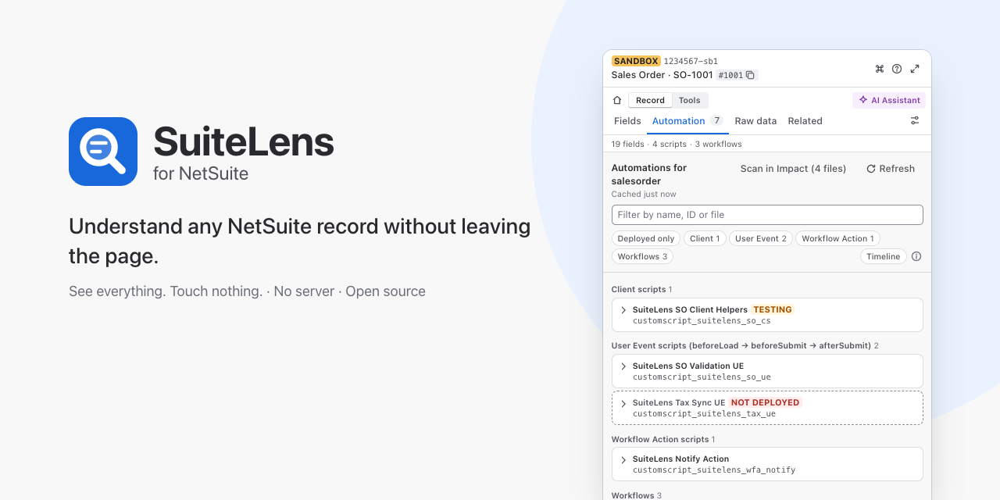
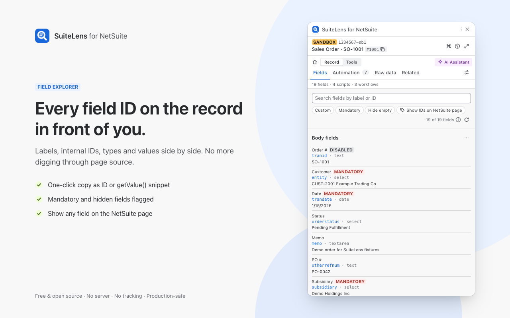
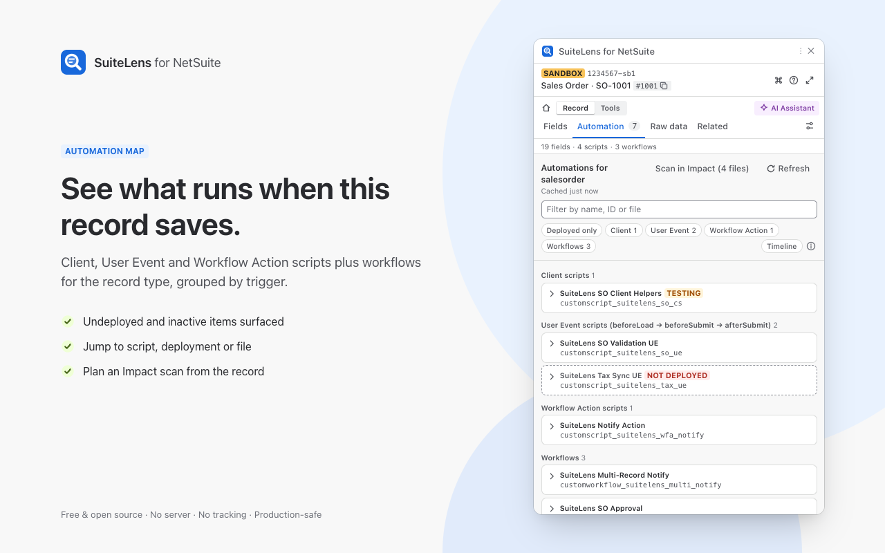
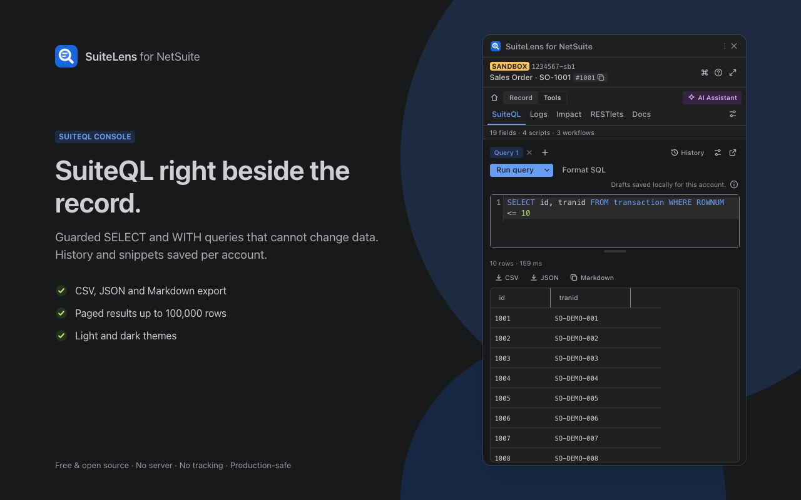

# SuiteLens for NetSuite

[](https://github.com/andynur/suitelens/actions/workflows/ci.yml)
[](LICENSE)
[](wxt.config.ts)
[](CONTRIBUTING.md)



SuiteLens is a free, open-source Chrome extension for NetSuite developers, admins and
consultants. It opens a side panel next to the record you are on and shows its field IDs, the
scripts and workflows that run on it, and a SuiteQL console, without leaving the page.

- **No server, no account, no tracking.** There is no backend. Nothing is sent anywhere unless
  you turn on an opt-in feature that says so.
- **Uses your session and your role.** SuiteLens sees only what your NetSuite role already sees.
  It never stores passwords, cookies or tokens.
- **Read-only by default.** The one feature that can write (RESTlet Tester) asks for
  confirmation and is blocked on production unless you allow it for that account.
- **Auditable.** MIT licensed. The extension is built from this repository; there is no remote
  code.

> **Status:** release candidate `1.0.0-rc.1`. The Chrome Web Store listing is pending, so install
> from source for now. See the [release checklist](docs/launch/release-checklist.md).

| Field Explorer | Automation Map | SuiteQL Console |
| --- | --- | --- |
|  |  |  |

Screenshots use fabricated fixture data.

## Features

**Record**

- **Fields:** body and sublist fields with label, ID, type, value and mandatory/custom flags.
  Search, filter and copy as `fieldId`, `'fieldId'` or a `getValue` snippet. Optional field-ID
  badges on the NetSuite form itself.
- **Automation:** client, user event and workflow action scripts, plus workflows, for the record
  type, with deployment status, log level and links.
- **Raw data:** the record's XML/JSON with masking, and a diff against another record of the
  same type.
- **Related:** linked transactions, explored a bounded number of levels deep.

**Tools**

- **SuiteQL:** a console that accepts only `SELECT`/`WITH`, with parameters, drafts, snippets,
  a table catalog, paging and CSV, JSON or Markdown export.
- **Logs:** script execution logs with local filters and error grouping.
- **Impact:** where a field or script ID may be referenced in sources SuiteLens can read. It
  lists what it could not check and never claims something is unused.
- **RESTlets:** send requests with your browser session. Writes need confirmation.
- **Docs:** a metadata-only context export for coding agents and an as-built preview of the
  current record type.

**Everywhere**

- **Environment Guard:** a colored banner per account (production, sandbox, release preview),
  with your own label and color.
- **Quick Go-to and command palette:** open a record by type and internal ID, or jump to any
  tab or action.
- **AI Assist (optional, bring your own key):** explain a script or error, or draft SuiteQL. You
  see and can edit exactly what will be sent first. AI never runs SQL on its own. Supported
  providers: Anthropic, OpenAI, Google Gemini, Groq, DeepSeek, Alibaba Qwen, Moonshot, Zhipu
  GLM, MiniMax, OpenRouter and Command Code.
- **Local MCP bridge (optional):** lets a coding agent on your computer make read-only calls
  through your open NetSuite tab. Each account needs your approval, which expires after one hour.
  Production is off by default. See [MCP setup](docs/mcp-setup.md).
- **Settings:** turn any feature off, Safe mode (all features off at once), light/dark theme, per-account environment
  colors, and delete all local data.

What works depends on your account and role permissions. See
[features and coverage](docs/launch/features.md) for the limits of each feature.

### Keyboard shortcuts

| Shortcut | Action |
| --- | --- |
| `Alt+Shift+L` | Open the side panel |
| `Alt+Shift+G` | Open Quick Go-to |
| `Ctrl+K` / `⌘K` | Command palette (inside the panel) |

Change the first two at `chrome://extensions/shortcuts`.

## Install from source

Requirements: Google Chrome, Node.js 22.22 or later (CI uses the version in `.nvmrc`) and
pnpm 10.

```bash
git clone https://github.com/andynur/suitelens.git
cd suitelens
pnpm install
pnpm build
```

Then in Chrome:

1. Open `chrome://extensions` and turn on **Developer mode**.
2. Click **Load unpacked** and select `.output/chrome-mv3`.
3. Open a NetSuite page (`https://<account>.app.netsuite.com/...`) and click the SuiteLens icon.

After you rebuild, reload the extension in `chrome://extensions` and refresh the NetSuite tab.

## Privacy and security

Without opt-in, the only network requests SuiteLens makes are same-origin requests to the
NetSuite page you have open, using your existing session. Two features can send data elsewhere,
and both are off until you turn them on:

- **AI Assist** sends the preview you reviewed to the provider you chose, with your own API key.
  The key is kept in session storage, or encrypted with your passphrase if you ask SuiteLens to
  remember it.
- **Local MCP** shares read-only results with a coding agent on your own machine, over Native
  Messaging, for one approved account and at most one hour.

Settings are stored in `chrome.storage.local` and cached metadata in IndexedDB, both separated
per NetSuite account ID. **Settings → Data** deletes everything.

Full policy: [PRIVACY.md](PRIVACY.md). Design rules: [docs/security-privacy.md](docs/security-privacy.md).
To report a vulnerability, follow [SECURITY.md](SECURITY.md). Do not open a public issue.

### Permissions

| Permission | Why |
| --- | --- |
| `sidePanel` | The UI lives in Chrome's side panel. |
| `storage` | Settings and per-account preferences. |
| `scripting` | Re-inject the content script into NetSuite tabs that were open before install or update. |
| `activeTab` | Act on the current tab when you use the toolbar button or a shortcut. |
| `https://*.app.netsuite.com/*` | Read the NetSuite page you are on. No other sites. |
| AI provider origin (optional) | Requested at runtime, only for the provider whose key you save. |
| `nativeMessaging` (optional) | Requested only when you connect the local MCP bridge. |

Rationale for each permission: [ADR 0003](docs/decisions/0003-permissions.md).

## Development

You do not need a NetSuite account to work on SuiteLens. All NetSuite access goes through
`NetSuiteAdapter` (`src/netsuite/adapter/`):

- `LiveAdapter` talks to the NetSuite tab through the background worker, the content script and
  a MAIN-world bridge that calls NetSuite's own `N/query` module with your session.
- `FixtureAdapter` reads fake data from [`fixtures/`](fixtures/). In dev builds,
  **Settings → Developer → Data source** switches between the two.

| Command | Purpose |
| --- | --- |
| `pnpm dev` | Dev build with hot reload in a Chrome instance. |
| `pnpm dev:fixtures` | Same, using `FixtureAdapter` (no NetSuite account needed). |
| `pnpm lint` | ESLint and Prettier check. |
| `pnpm typecheck` | `tsc --noEmit`. |
| `pnpm test` | Unit tests (Vitest). `pnpm test:coverage` for coverage. |
| `pnpm test:e2e` | Playwright tests against `fixtures/pages/*.html`. |
| `pnpm build` / `pnpm zip` | Production build / zipped extension. |
| `pnpm verify` | Lint, typecheck, unit tests, MCP tests, docs build and production build. Run before every PR. |
| `pnpm docs:build` | Build the static documentation site into `.site/`. |

### Project layout

```
src/
  entrypoints/   background worker, content script, MAIN-world bridge, side panel
  netsuite/      adapter, bridge protocol (Zod), context detection, SuiteQL queries, parsers
  features/      one folder per feature (field-explorer, automation-map, suiteql-console, ...)
  shared/        storage, i18n, feature flags, logger, UI primitives
packages/
  mcp-bridge/    optional local MCP server and Native Messaging host
fixtures/        fake NetSuite responses and page snapshots (no real data)
tests/e2e/       Playwright tests
docs/            architecture, security and privacy, decision records (ADRs)
prd/             product requirements per version
```

NetSuite behavior that could not be confirmed without a live account is marked `// VERIFY:` in
the code, with defensive handling and a fixture.

## Contributing

Bug reports, fixes and small focused PRs are welcome. Start with
[CONTRIBUTING.md](CONTRIBUTING.md). The repository rules for security, layout and required
checks are in [CLAUDE.md](CLAUDE.md); they apply to every change, whether or not you use a
coding agent. This project follows a [Code of Conduct](CODE_OF_CONDUCT.md).

## Credits

Inspired by the NetSuite developer community and existing free tools such as field explorers,
scripted-record viewers and SuiteQL consoles. No code, UI text or assets were copied from other
extensions.

## License

[MIT](LICENSE)

## Disclaimer

NetSuite, SuiteScript, SuiteQL, SuiteCloud and SuiteApp are trademarks of Oracle Corporation.
This project is not affiliated with, sponsored by or endorsed by Oracle.
